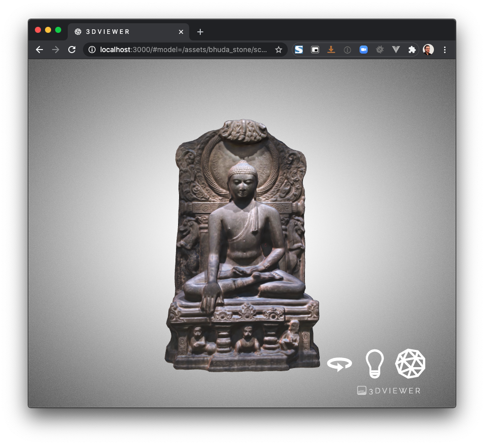

# 3dviewer


This viewer is a customised/modified version of (Don McCurdy viewer)[https://github.com/donmccurdy/three-gltf-viewer], which has a kiosk mode and a direct call to model not really documented.
Those are the simple features added :
- documentation on how to call it with local assets
- 3 simple buttons to toggle on/off the 3 main features our tests revealed to be the fastly end-user appropriated
- a loading spindle

License : MIT License
 
## Load a GLTF file from its URL
https://domain.ext/index.html#model=https://domain.ext/inrap3d/montagne-de-lure-france/source/Lardiers%20Lure.glb

## Important
Files need to be served from the same server than the viewer to avoid CORS errors

## TODO
-[x] simple icons for lights on/off, wireframe...
-[ ] download as a zip with index.html renamed for direct deployment
-[ ] remove and embed from root to be able to run inside subfolders

## Will not be done
- Add the ability to load from other servers : WNBD

## How to test
With npm installed :
```
npm run dev
```

Then, load a browser to :

http://localhost:3000/#model=/assets/bhuda_stone/scene.gltf



3D mesh : https://skfb.ly/VBtF
Bhuda Stone, by Francesco Coldesina, CC-BY

## How to deploy

Simply upload dist folder content, I suggest to upload a directory of your meshes inside it.
Best is to use a subdomain to store everything.
If needed, index.html in the dist can be renamed, for example as 3dviewer.html

## How to embed and style
Use a simple iframe to embed your viewer inside your project :
```
<iframe 
    style="margin:0;padding:0;width:100%;height:500px;" 
    src="http://localhost:3000/#model=/assets/bhuda_stone/scene.gltf" >
</iframe>
``` 

## How to convert your meshes to GLTF format

GLTF is meant to be the JPEG for 3D by the Khronos group, you can have more informations there :
https://www.khronos.org/gltf/


 
